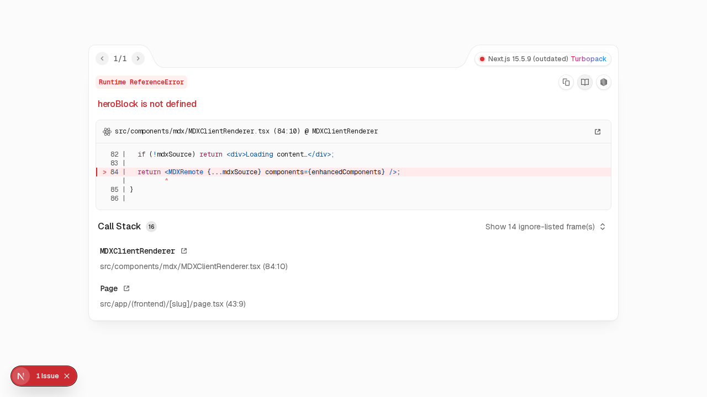
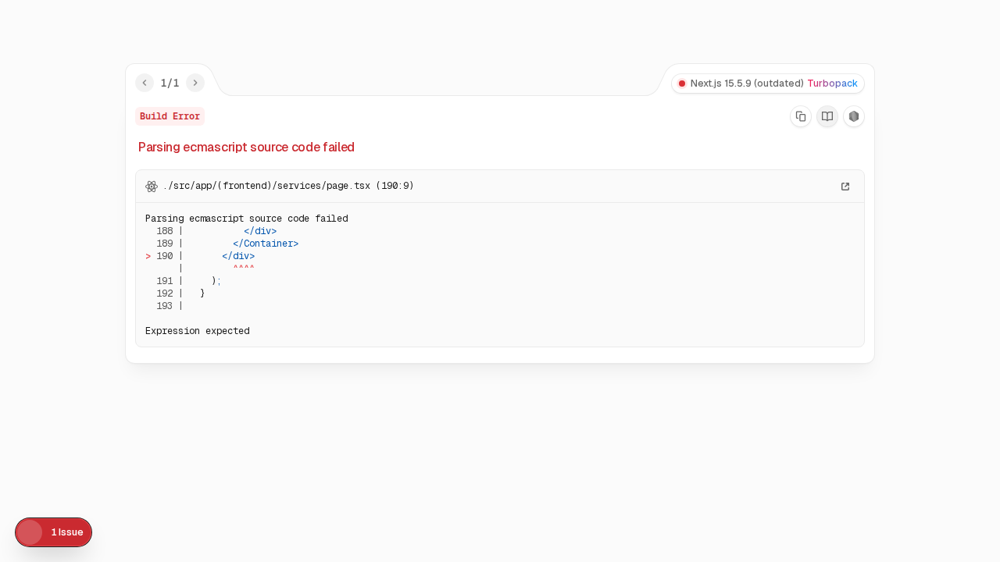
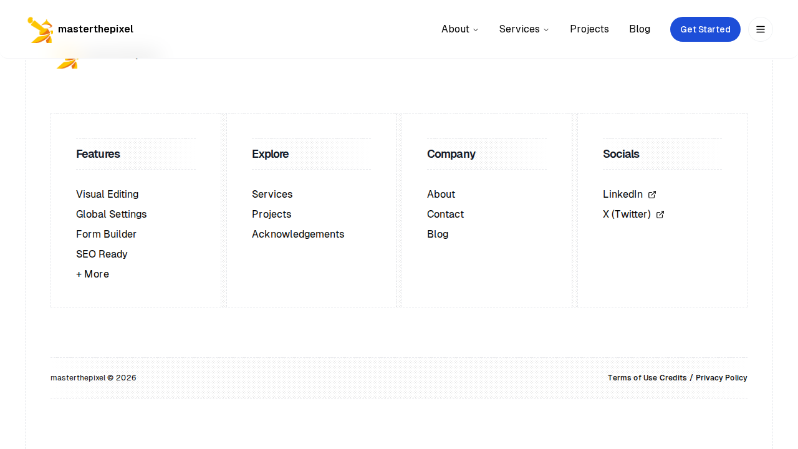
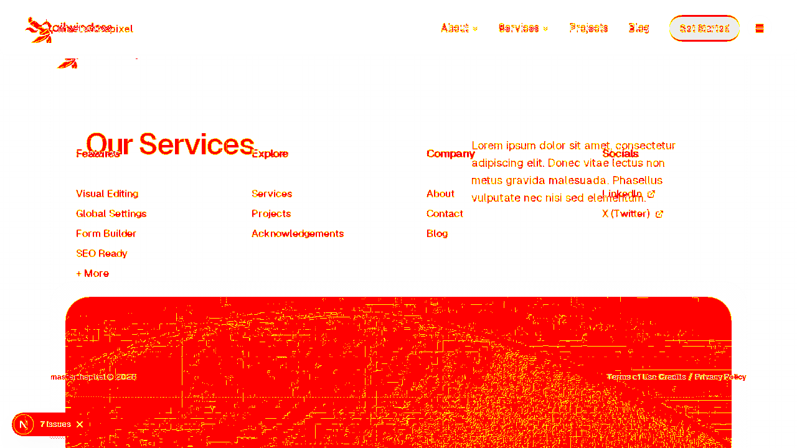

# Visual diffs from latest E2E run

## Overview
The Playwright visual-snapshot run reported differences for these MDX pilot pages:

- `home-mdx` — baseline present (`tests/e2e/.../home-mdx-chromium-linux.png`)
- `about-mdx` — baseline present (`tests/e2e/.../about-mdx-chromium-linux.png`)
- `services-mdx` — **baseline + actual + diff** available below

---

## Home (baseline)

---

## About (baseline)

---

## Services (baseline / actual / diff)

- Playwright reported: **38,460 pixels different (~5% of image)**

Baseline (expected):

Actual (latest run):

Diff (areas that changed):

---

Next steps I can take for you:

1. Inspect and attempt to fix the UI so the _actual_ matches the _baseline_. (I can open a PR with the fix.)
2. Accept the new visuals and update the Playwright snapshot baselines (I can open a PR with updated snapshots).
3. Do nothing yet — just keep these diffs for manual review.

Tell me which of the three actions above you want me to take, or authorize me to proceed with my recommended choice (recommendation: review diffs, then fix CSS if the change is unintended; otherwise update snapshots).